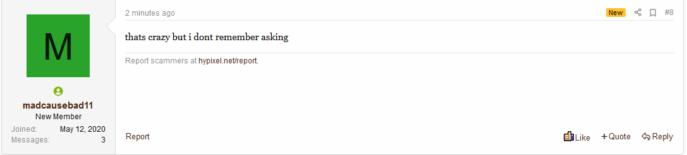

I wrote this story on the Hypixel Forums a while ago, but I realized it would be a good idea if I posted it on my blog too.

# Intro

ReportScammers was a robot on the Hypixel SkyBlock Forums that automatically replied to posts where people were complaining that they got scammed.
It all started on April 27th, 2020. I was bored and wanted to make a Hypixel Forums bot. At first, I wasn’t sure what I wanted it to do. Then I thought, “what’s a task that humans do often that could be easily automated?”: complaining about people getting scammed, of course.

# madcausebad11

I didn’t do anything with this idea until a couple weeks later on May 14th, when I remembered it, and was actually motivated to create it. I asked around on the SkyBlock Community Discord for what it should be called and what it should do, and I decided on calling it madcausebad11 (name chosen by @TatorCheese), and making it say “thats crazy but I dont remember asking” (@Bliziq chose that one) to all posts that mentioned being scammed.
->  ->
When that had been decided, I started working on the code. It was written in Python, using BeautifulSoup to scrape the web pages and aiohttp to make the requests. After an hour of writing code, madcausebad11 was working.

Less than an hour after the bot started working, it got banned for the reason “spam”.

# reportScammers

A day after madcausebad11 got banned, I decided to make it again, but better. This time, I was going to make it look like a human. I added more delays, random messages, a profile picture made in MSPaint, and fixed more false positives. This became what you all (probably) know, and (maybe) love, reportScammers.
This version of the bot also wasn’t toxic, as it just said “Please report scammers at hypixel.net/report” (or some variation of that) to all messages complaining about being scammed, and people didn’t hate it that much this time.
I checked the forums often on this account, so if anyone talked about the bot I would be able to respond, and there were some people that called reportScammers a minimod and a bot, but it was fairly unknown so most people didn’t care.
There were, of course, people that suspected reportScammers was a bot. Every time I saw one of these messages, I responded manually, sometimes pretending to get angry about people thinking it was a bot, even though it was. There were also many posts baiting the bot to reply, by making the title of their post a variation of “I got scammed”, even though they didn’t. To combat this, I made the bot only reply to messages from new members, as well-known members were likely only trying to post farm.
I had a few problems making the bot work well though, such as the Cloudflare captcha screen, meant to prevent bots from scraping the forums. However, reportScammers wasn’t a bot, so I found a Python library meant to bypass it and tweaked the source code to make the library asynchronous.
Near this time I also updated the logo for reportScammers in Photoshop, but still with the MSPaint vibe.

# Dafty = reportScammers???

On June 9th, a member of the SkyBlock Community Discord followed reportScammers, and they told me “follow me back”, “thats rude”, so I did. This user was @Dafty. I pointed out how the only person reportScammers was following was Dafty, so people will think they run the account.
We got @pigeo to write a forum thread “exposing” reportScammers, and then some people starting making their own forum threads, and then I wrote my own forum thread titled “Addressing the reportScammers situation” on my main account.
However, we had to go further. Dafty asked @SecureConnection to change the name of their alt to reportScammers, so we could link the forum account and look even more human. At this time I also gave the login details of the account to Dafty, so he could help reply to messages faster, and farm more messages. Dafty also created a Minecraft skin for the account, which was simply a Steve holding a Hypixel logo.

# The death of reportScammers

At this time, many parody accounts started popping up, such as reportScammersbrother, scam-bot, NoPublicShaming, and NoTrollingBotXD.
One day, I noticed reportScammers had suddenly stopped replying to posts. I first thought this must just be a glitch with the code, but when I looked further, I could not find any recent posts complaining about being scammed. Maybe people just stopped getting scammed? I thought this was the reason, but no staff members wanted to confirm. I made another alt account to test this, and I found out that the admins have disabled new members from being able to create posts with the word “scammed” in them.
I sadly went to disable the code running the bot, but wanted to make one last message as reportScammers. This thread is the first and last thread by reportScammers, created by @matdoesdev.
