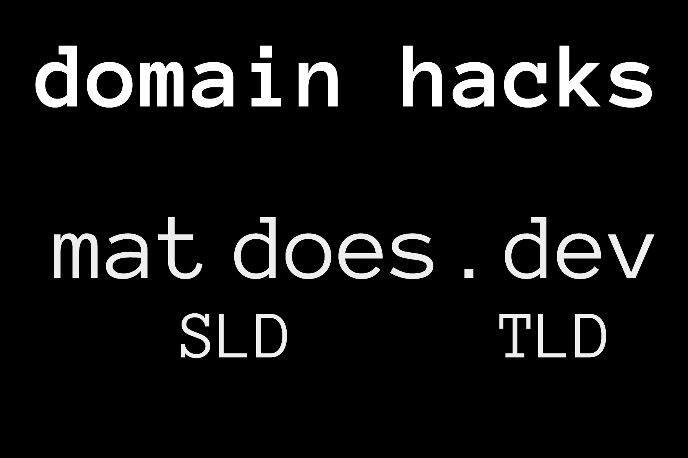
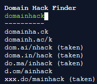

**A domain hack is a domain in which both the top level domain (TLD) and the second level domain (SLD) are combined to make up a word or phrase.**
For example, matdoes.dev is a domain hack for mat does dev.
Domain hacks are _not_ security-related and they are completely legal.

Most domain hacks use country code top level domains (ccTLDs), for example, .it is for italy, .am is for Armenia, etc.
Some companies even purchase their own custom TLDs from the [Internet Assigned Numbers Authority](https://www.iana.org/) in order to create a hack for their domains. Most notably is goo.gle, which was created by Google as a domain hack for their website.

---

# Why Use a Domain Hack?

An advantage to using a domain hack is that your domain is much shorter and therefore easier to remember. Many URL shortening sites such as bit.ly, goo.gl (Google), youtu.be, etc, use domain hacks to make their URLs shorter.

## Domain hacks are more fun than normal domains, too, which increases the chance of people clicking on them in search results.

# How to Choose a Domain Hack?

Finding a good domain isn't always easy, so I've created a tool hosted on [Repl.it](https://repl.it) that helps you find domain hacks

[Click here to view the domain hack finder](https://repl.it/talk/share/Domain-Hack-Finder/15778)

At the moment, it uses every TLD currently in existence, which may not be what you want since some top level domains cannot be used by most people as they require you to live in a certain area or work for a certain organization. You can customize it by adding or removing from the tlds.txt file.

My tool also checks whether a domain is already taken by someone by seeing if the website has any DNS records. Also, be aware that some TLDs are stupidly expensive. For example, .ng domains can go for up to $50,000
