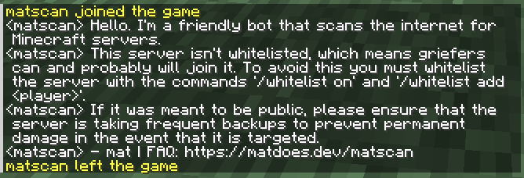

# Why did "matscan" join my Minecraft server? (FAQ)

[Note for translators: Feel free to put credits for yourself here like "Translated by NAME".]

matscan is a Minecraft bot that joins potentially vulnerable Minecraft servers and sends a message in chat to inform the admins.

## How should I secure my server?

- Enable backups, and maybe additionally install a plugin like [CoreProtect](https://www.spigotmc.org/resources/coreprotect.8631/).
- If the server was meant to be private: Enable a whitelist by running the commands `/whitelist on`, `/whitelist add <player>`, and by setting `white-list=true` in the `server.properties` file.
- If the server is offline-mode: Enable `online-mode` in the `server.properties` or install a plugin such as [AuthMeReloaded](https://dev.bukkit.org/projects/authme-reloaded).
- If the server has an exposed BungeeCord backend: Firewall it, install [BungeeGuard](https://www.spigotmc.org/resources/bungeeguard.79601/), or switch to [Velocity](https://papermc.io/software/velocity).

If you've done all of the above that apply to you, then you're probably fine.

## How did you find my server?

I scan the internet for Minecraft servers, basically sending a packet to every IP address and seeing which ones respond (it's a little more complex than this).

## Is your data public?

No. You should still secure your server though since there are several griefing/harassment groups that use their own server scanners.

## Why did Herobrine try to join right before matscan?

matscan will try to join with the username Herobrine first, so if the server is offline-mode then it can demonstrate that people can join with any username. It may also use the username of a player that has been online before if the server is offline-mode but has a whitelist.

## What IP does matscan join from?

The bot will exclusively join from the IP address `151.115.73.107`. This page will be updated if it ever changes in the future.

## How can I contact you?

You can email me at mat@matdoes.dev (<a href="/mat.asc" rel="external">public key</a>).

## How can I help?

If you appreciate the security work I do, please consider funding my projects at [ko-fi.com/matdoesdev](https://ko-fi.com/matdoesdev).
